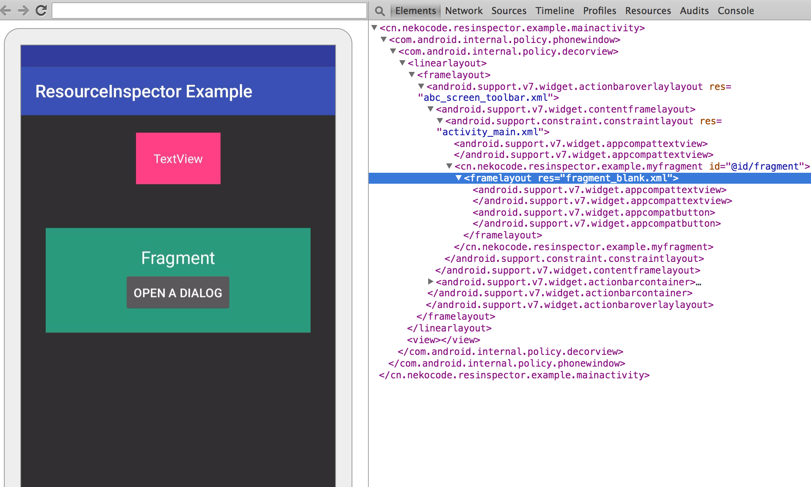

# README
[](http://www.apache.org/licenses/LICENSE-2.0.html) [](https://jitpack.io/#nekocode/ResourceInspector)

A debug tool to inspect the used layout files of current Activity. This tool is helpful when you want to find out the layout xml files used in current Activity from a large amount of resource files.

This tool depenends on the **[Stetho](http://facebook.github.io/stetho/)** library. After you intergate this library, you can open the inspector in your Chrome's DevTools page (you can navigate to `chrome://inspect` for opening it).



## Getting started

In your `build.gradle`:

```gradle
repositories {
    maven { url "https://jitpack.io" }
}
dependencies {
    debugCompile "com.github.nekocode.ResourceInspector:resinspector:${lastest-version}"
    releaseCompile "com.github.nekocode.ResourceInspector:resinspector-no-op:${lastest-version}"
    testCompile "com.github.nekocode.ResourceInspector:resinspector-no-op:${lastest-version}"

    compile "com.facebook.stetho:stetho:${stetho-lastest-version}"
}
```

In your `Application` class:

```java
public class MyApplication extends Application {
    @Override
    public void onCreate() {
        super.onCreate();
        ResourceInspector.initialize(this);
    }
}
```

In your (Base) `Activity` class:

```java
public class BaseActivity extends Activity {
    @Override
    protected void attachBaseContext(Context newBase) {
        super.attachBaseContext(ResourceInspector.wrap(newBase));
    }
}
```
